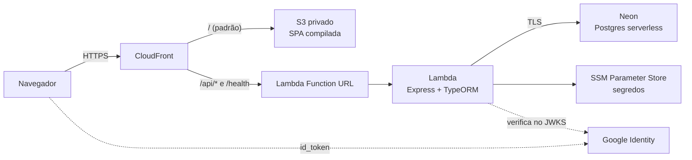

# 🎬 Cinehal

Recomendação de filmes no formato de baralho: um filme por vez, e quatro ações. As escolhas alimentam um perfil de tags que ordena o que vem depois.

### Funcionalidades

- **Baralho de recomendação** — um filme por vez, com capa, sinopse, crítica, elenco, direção, duração e onde assistir. Quatro ações: *já assisti*, *quero assistir*, *não quero assistir* e *desfazer*.
- **Perfil de gosto** — quem marca "já assisti" diz também se gostou. Cada escolha soma pontos nas tags do filme, e é esse acúmulo que ordena as recomendações seguintes.
- **Filtros por tag** — restringe o baralho a gêneros e temas escolhidos. Ao fim da lista, os filtros se limpam sozinhos.
- **Minhas listas** — o que foi marcado fica em listas separadas por status.
- **Conquistas** — marcos por hábito de quem assiste ("Que drama!" depois de cinco filmes de drama, e assim por diante).
- **Preferências iniciais** — no primeiro acesso, o usuário escolhe tags para o perfil não começar vazio.
- **Tutorial e créditos** — apresentação das ações na primeira visita, e a lista de quem construiu o projeto.

O projeto nasceu na disciplina **[AGES / PUCRS](https://tools.ages.pucrs.br/cine-clube/cineclube-wiki)** e foi desenvolvido em um único semestre (veja os [créditos](#-créditos)).

## 🧰 Stack da aplicação

| Camada | Tecnologia |
|---|---|
| Frontend | React 17 · TypeScript · Material-UI v4 · axios |
| Backend | Node 18 · Express · tsoa (rotas + Swagger) · TypeORM 0.2 |
| Testes | Jest — 156 no backend |

---

## 🔧 O que foi adicionado depois

**Nada desta seção faz parte das entregas da AGES.** O código de produto
descrito acima é das equipes; a infraestrutura, o deploy e a autenticação
atuais vieram depois, como trabalho posterior ao projeto original.

### Arquitetura atual



O CloudFront é o único endereço público: serve a SPA do S3 (bucket privado, via Origin Access Control) e encaminha `/api/*` para a Lambda. Por serem o mesmo domínio, não há CORS e a sessão viaja em cookie `HttpOnly`.

**Custo em regime:** S3 e CloudFront em centavos; Lambda, Function URL, Parameter Store e Neon dentro do free tier.

### Stack de infraestrutura

| Camada | Tecnologia |
|---|---|
| Banco | PostgreSQL 18 no Neon (endpoint com pooler) |
| Identidade | Google Identity Services → sessão própria JWT HS256 |
| Infra | Lambda · S3 · CloudFront · SSM Parameter Store |

### Monorepo e um único compose

`backend/` e `frontend/` viviam em repositórios separados, cada um com seu deploy. Passaram a ser um só repositório, com um `docker-compose.yml` na raiz apontando para os dois contextos de build.

> 🪤 O build do CRA sozinho passa de 1 GB de heap. Numa `t3.micro` de 1 GB, subir os dois serviços em paralelo estourava a memória — daí o build ser sequencial e a instância ganhar 4 GB de swap.

### Banco: de container para o Neon

O Postgres rodava num container ao lado da aplicação, o que prendia o dado ao ciclo de vida da máquina — e impedia qualquer caminho serverless, porque função não roda um banco ao lado.

A aplicação passou a aceitar `DB_URL` com a connection string inteira; sem ela, o caminho antigo (host/porta/usuário) continua valendo para desenvolvimento local. No caminho gerenciado, o TLS exige **certificado verificado** — o do Neon encadeia numa CA pública, então não há motivo para abrir mão da proteção contra MITM.

### EC2 → Lambda + S3

A EC2 rodava nginx, API e banco, cobrada por hora mesmo parada. Hoje:

- o Express é embrulhado por `serverless-http` num handler próprio;
- a SPA compilada vai para um bucket S3 privado;
- o CloudFront assume o papel de roteador que era do nginx.

O que a EC2 custava (instância + IPv4 público) saiu da conta.

> 🪤 O handler monta o app **fora** do handler para aproveitar containers mornos, e reconfere a conexão a cada invocação — o pooler do Neon fecha conexões ociosas, e o container volta morno com a conexão já morta.

### Autenticação de verdade

O Firebase tinha sido removido em algum momento e o que ficou no lugar não verificava nada: o token era um JSON em base64 montado pelo próprio cliente. Na prática, mandar `Authorization: <id-de-alguém>` devolvia os dados daquela pessoa.

Assinar no frontend não resolveria — a chave estaria no bundle. A emissão foi para o servidor:

1. o Google Identity Services entrega o `id_token` ao navegador;
2. o backend verifica a assinatura contra o JWKS do Google, com `audience` preso ao client id e `issuer` restrito aos domínios oficiais;
3. o backend emite **sessão própria** (HS256, 8 h) em cookie `HttpOnly; Secure; SameSite=Lax`.

A sessão é separada do `id_token` de propósito: ele é prova de identidade de uso único, e reapresentá-lo a cada requisição amarraria a aplicação ao ciclo de vida dele.

Junto vieram dois defeitos antigos: o `transformResponse` do axios era passado como **corpo** do POST (o segundo argumento é o `data`, não a config) e por isso nunca rodava; e a leitura de `first_login` nunca batia com o `firstLogin` que o backend responde — motivo de a tela de preferências não aparecer no primeiro acesso.

### Segredos

Ficam no **SSM Parameter Store** como `SecureString`, lidos pela Lambda em uma única chamada no cold start. Não há connection string nem chave em código versionado.

Variável de ambiente foi descartada por um motivo específico: `lambda:GetFunctionConfiguration` está dentro da policy gerenciada `ReadOnlyAccess`, então qualquer acesso somente-leitura à conta leria os segredos. Ler do Parameter Store exige `ssm:GetParameter` **e** `kms:Decrypt`, concedidos deliberadamente.

Os valores também não ficam no estado da infraestrutura, escritos em modo
*write-only*.

### Layout para desktop

A tela principal fora desenhada para celular, onde a coluna de 700 px preenche o visor. No desktop ela aparecia encostada à esquerda: dois blocos declaravam `maxWidth` sem `margin: auto`. A largura virou uma declaração única, usada pelo fundo, pelo conteúdo e pela barra de ações.

---

## 🚀 Rodando localmente

**Pré-requisitos:** Node 18 (o `react-scripts` 4 não roda em versões recentes), Docker opcional.

```bash
# backend
cd backend
npm install
# crie um .env com as variáveis da tabela abaixo
npm run typeorm -- migration:run
npm run db:seed         # não é idempotente: rode uma vez
npm run dev             # http://localhost:5000 · docs em /doc

# frontend
cd frontend
npm ci
npm start               # http://localhost:3000
```

### Variáveis do backend

| Variável | Para quê |
|---|---|
| `DB_URL` | Connection string completa. Quando presente, as variáveis avulsas abaixo são ignoradas |
| `DB_HOST` `DB_PORT` `DB_DATABASE` `DB_USERNAME` `DB_PASSWORD` | Postgres local. Deixe `DB_SSL` fora — container não fala TLS |
| `GOOGLE_CLIENT_ID` | Client ID OAuth (tipo *Web application*). Público |
| `SESSION_SECRET` | Chave que assina as sessões |
| `PORT` | Padrão 5000 |

O frontend precisa de `REACT_APP_API_URL` (use `/api/v1`, relativo) e `REACT_APP_GOOGLE_CLIENT_ID`.

> Para o login funcionar, o domínio precisa estar em **Authorized JavaScript origins** no console do Google Cloud.

### Testes

```bash
cd backend && npx jest        # 156 testes
```

## 📦 Deploy

A infraestrutura é provisionada fora deste repositório.

```bash
# backend: empacota a função (~33 MB)
cd backend && ./build-lambda.sh

# frontend: compila e publica a SPA
cd frontend && npm run build
aws s3 sync build s3://<bucket> --delete
aws cloudfront create-invalidation --distribution-id <id> --paths '/*'
```

Bucket, distribuição e endereço público são próprios de cada ambiente e não
ficam versionados.

Migrations continuam manuais, rodadas contra o banco — elas são do ciclo de vida dele, não do da aplicação.

---

## 👥 Créditos

> O grupo Cinehal agradece a equipe de desenvolvimento.

Um semestre, quatro equipes. Os nomes abaixo são os mesmos exibidos na tela de Créditos do aplicativo.

**AGES 1**
- Alexya Silva Rocha de Oliveira
- Bruno Breyer Garcia
- Henrique Derlam Zwetsche
- Leonardo José Machado Canto

**AGES 2**
- Augusto César Bottega Agostini
- Lucas Dimer Justo

**AGES 3**
- João Pedro Laureano
- Pâmela Mendonça Barreto
- Patrick Mazzuco Flores
- Eduardo Schweitzer Nunes da Silva
- Gabriel Ferreira Kurtz

**AGES 4**
- Chiara Girardi Paskulin
- Alexandre Scheer Bing
- Matheus Lima Ferreira

Projeto acadêmico da **AGES — Escola Politécnica da PUCRS**.

---

## 📄 Documentação por módulo

`backend/README.md` e `frontend/README.md` descrevem o projeto como ele foi entregue pelas equipes originais, incluindo referências ao Heroku e ao Firebase que não valem mais. Ficam como registro.
